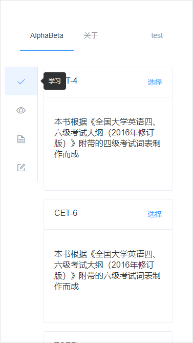
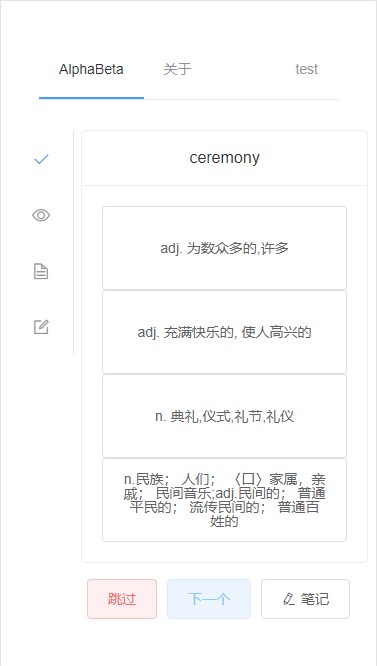
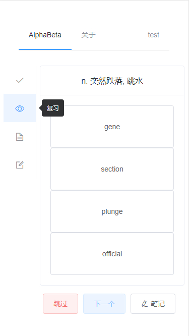
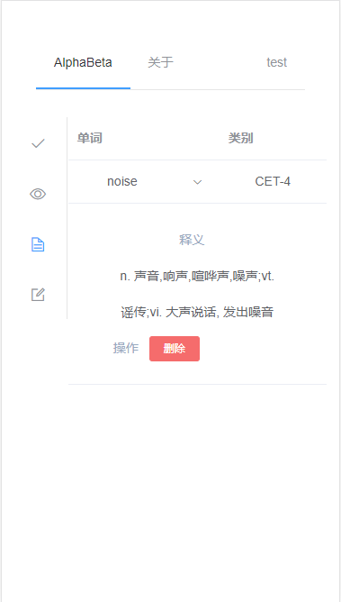

# AlphaBeta
AlphaBeta is a webapp that help remember and recite words and vocabularies.

* **Vue:** AlphaBeta uses Vue, Vue Router to implement the frontend of webapp.
* **Express and MongoDB:** AlphaBeta uses Express.js and MongoDB as backend.
* **Single Page Application** And AlphaBeta uses the characteristics of Vue and Vue Router to implement a state-of-the-art SPA. 
* **Responsive layout** AlphaBeta implements a responsive layout for both PC and phone.

## WebApp Example

### Home

### Study

### Review

### Note
